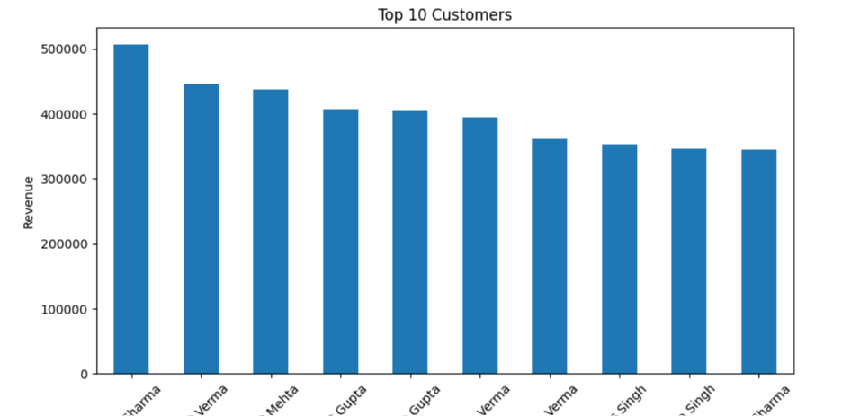
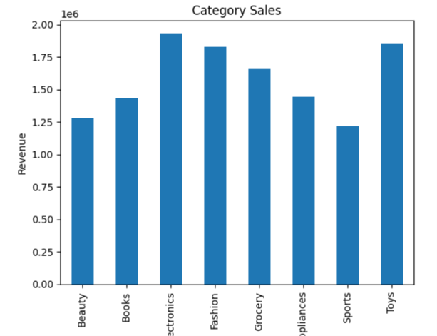
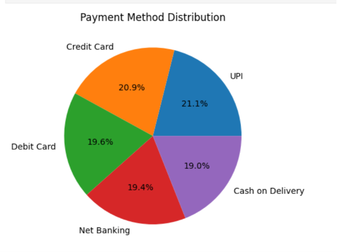
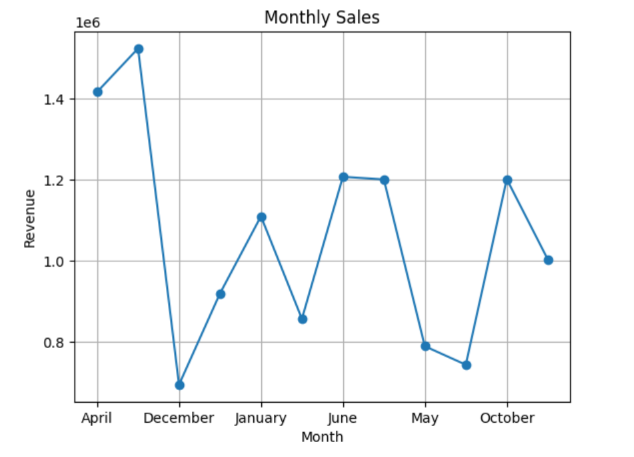

# ecommerce-customer-analysis
EDA on e-commerce transaction data using Python

---

# 📖 Project Overview

The E-commerce Customer & Sales Analysis project transforms raw transaction data into meaningful business insights using Python — covering data cleaning, feature engineering, exploratory data analysis, and visualization.

---

# 🎯 Business Objectives

- Analyze overall sales performance and revenue trends.
- Identify top-performing product categories and cities.
- Understand customer demographics and purchasing behavior.
- Evaluate payment method preferences.
- Track monthly sales trends over time.
- Identify high-value orders and customer satisfaction patterns.
- Support data-driven business decisions through clear visual insights.

---

# 🛠️ Tools & Technologies

| Tool | Purpose |
|------|---------|
| 📊 Excel/CSV | Raw Data Source |
| 🐍 Python (Pandas, NumPy, Matplotlib) | Data Cleaning, EDA & Visualization |
| 📓 Jupyter Notebook | Analysis Environment |
| 📂 Git & GitHub | Version Control & Project Portfolio |

---

# 🔄 Project Workflow

Raw Dataset (CSV)

⬇️

Data Cleaning & Preprocessing (Python)

⬇️

Feature Engineering (Month/Year Extraction)

⬇️

Exploratory Data Analysis (Pandas)

⬇️

Data Visualization (Matplotlib)

⬇️

Business Insights & Conclusions

---

# 📊 Analysis Sections

## 🧹 Data Cleaning
- Handled missing values (City, Rating)
- Removed duplicate records
- Converted Order_Date to datetime and extracted Month/Year

## 👥 Customer Analysis
- Top 10 customers by revenue
- Customer age distribution
- Gender distribution

## 💰 Sales Analysis
- Sales by category
- Top-selling products
- Revenue by city
- Revenue by payment method
- Monthly sales trend

## 📈 Visualizations
- Top 10 Customers by Revenue
- Category-wise Sales
- Payment Method Distribution
- Monthly Sales Trend
- Customer Age Distribution
- Revenue by City
- Order Amount Distribution (Box Plot)

---

# 📌 Key Insights

- **Total Revenue:** ₹1,26,57,884 across 1,000 orders
- **Average Order Value:** ₹12,657.88
- **Top-Performing Category:** Electronics
- **Top-Performing City:** Pune
- **Most-Used Payment Method:** UPI
- **Average Customer Rating:** 3.03 / 5

---

# 📂 Project Structure
```

E-commerce-Customer-Analysis
│
├── Data
│   └── e-commerce.csv
│
├── Python
│   └── ecommerce_customer_analysis.ipynb
│
├── Screenshots
│   ├── Top_Customers.png
│   ├── Category_Sales.png
│   ├── Payment_Method_Distribution.png
│   └── Monthly_Sales_Trend.png
│
└── README.md
# 📸 Visualization Preview

## Top 10 Customers by Revenue



---

## Category-wise Sales



---

## Payment Method Distribution



---

## Monthly Sales Trend



---

# 💼 Skills Demonstrated

- Data Cleaning
- Data Wrangling
- Exploratory Data Analysis (EDA)
- Feature Engineering
- Data Visualization
- Business Analytics
- Customer & Sales Analysis

---

# 🚀 Future Improvements

- Customer segmentation using clustering (RFM analysis).
- Sales forecasting using time series models.
- Interactive dashboard using Power BI or Streamlit.
- Cohort analysis for customer retention.

---

# 👩‍💻 Author

**Yogita Thakur**

Aspiring Data Analyst passionate about transforming raw data into actionable business insights through analytics and visualization.

### ⭐ If you found this project helpful, don't forget to Star this repository!
